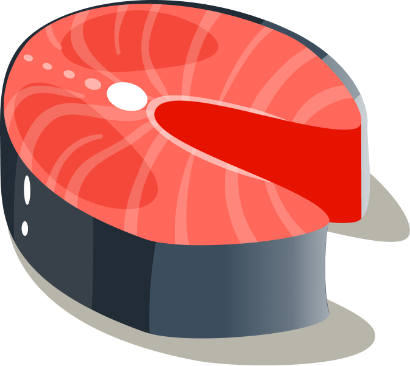
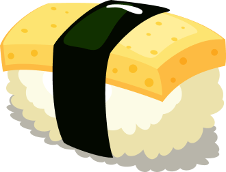
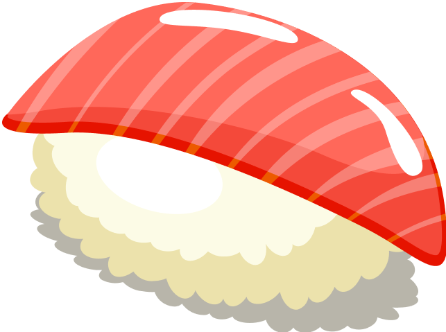

<div align="center">
  <br />
    <a href="https://youtu.be/QRrPE9aj3wI?feature=shared" target="_blank">
      
    </a>
  <br />

  <div>
    
    
  </div>

  <h3 align="center">Sushi Website</h3>

   <div align="center">
     Build this project step by step with our detailed tutorial on <a href="https://www.youtube.com/@javascriptmastery/videos" target="_blank"><b>JavaScript Mastery</b></a> YouTube. Join the JSM family!
    </div>
</div>

## 📋 <a name="table">Table of Contents</a>

1. 🤖 [Introduction](#introduction)
2. ⚙️ [Tech Stack](#tech-stack)
3. 🔋 [Features](#features)
4. 🤸 [Quick Start](#quick-start)
5. 🕸️ [Snippets](#snippets)
6. 🔗 [Links](#links)
7. 🚀 [More](#more)

## 🚨 Tutorial

This repository contains the code corresponding to an in-depth tutorial available on our YouTube channel, <a href="https://www.youtube.com/@javascriptmastery/videos" target="_blank"><b>JavaScript Mastery</b></a>. 

If you prefer visual learning, this is the perfect resource for you. Follow our tutorial to learn how to build projects like these step-by-step in a beginner-friendly manner!

<a href="https://youtu.be/QRrPE9aj3wI?feature=shared" target="_blank"></a>

## <a name="introduction">🤖 Introduction</a>

Develop a sushi website showcasing popular food, trending sushi, and drinks using HTML and CSS with smooth subtle animations. 

If you're getting started and need assistance or face any bugs, join our active Discord community with over 27k+ members. It's a place where people help each other out.

<a href="https://discord.com/invite/n6EdbFJ" target="_blank"></a>

## <a name="tech-stack">⚙️ Tech Stack</a>

- HTML 5
- CSS 3
- Vite

## <a name="features">🔋 Features</a>

👉 **CSS Variables**: Utilize CSS variables to maintain a consistent and easily adjustable styling approach throughout the project

👉 **Importing CSS Files**: Import CSS files into others, promoting modularity and organization in styling.

👉 **Flex and Position Properties**: Use of flex and position properties in CSS to create responsive and well-structured layouts.

👉 **Rendering HTML through JavaScript**: Rendering HTML through JavaScript using reusable functions, enhancing code efficiency.

👉 **Smooth Animations**: Smooth and subtle animations to enhance the overall user experience, focusing on fluid transitions.

👉 **BEM Method**: Follow the Block Element Modifier (BEM) methodology for naming classes, promoting a clear and maintainable structure.

👉 **Organized File and Folder Structure**: Maintain a well-organized file and folder structure for easy navigation and management of project assets.

👉 **Responsive Design**: The application is completely responsive across all devices, employing responsive design techniques such as media queries and fluid layouts.

all these while creating the sushi website with,
* Navigation Bar
* Creative Hero Section
* About Us Section
* Popular Food, Trending Sushi, and Drinks Sections
* Newsletter Signup and Footer


## <a name="quick-start">🤸 Quick Start</a>

Follow these steps to set up the project locally on your machine.

**Prerequisites**

Make sure you have the following installed on your machine:

- [Git](https://git-scm.com/)
- [Node.js](https://nodejs.org/en)
- [npm](https://www.npmjs.com/) (Node Package Manager)

**Cloning the Repository**

```bash
git clone https://github.com/adrianhajdin/project_html_css_website.git
cd project_html_css_website
```

**Installation**

Install the project dependencies using npm:

```bash
npm install
```

**Running the Project**

```bash
npm run dev
```

Open [http://localhost:5173](http://localhost:5173) in your browser to view the project.

## <a name="snippets">🕸️ Snippets</a>

<details>
<summary><code>index.html</code></summary>

```html
<!DOCTYPE html>
<html lang="en">

<head>
  <meta charset="UTF-8" />
  <link rel="icon" type="image/svg+xml" href="/sushi.png" />
  <meta name="viewport" content="width=device-width, initial-scale=1.0" />
  <link rel="stylesheet" type="text/css" href="css/style.css" />
  <title>Sushiman</title>
</head>

<body>
  <!-- START: header -->
  <header>
    <nav class="header__nav">
      <div class="header__logo">
        <!-- This how we use aos. Simply specify the type of animation using data attribute -->
        <h4 data-aos="fade-down">Sushiman</h4>

        <div class="header__logo-overlay"></div>
      </div>

      <ul class="header__menu" data-aos="fade-down">
        <li>
          <a href="#menu">Menu</a>
        </li>
        <li>
          <a href="#food">Food</a>
        </li>
        <li>
          <a href="#services">Services</a>
        </li>
        <li>
          <a href="#about-us">About Us</a>
        </li>
        <li>
          
        </li>
      </ul>

      <!-- Display Menu icon on small devices -->
      <ul class="header__menu-mobile" data-aos="fade-down">
        <li>
          
        </li>
      </ul>
    </nav>
  </header>
  <!-- END: header -->

  <!-- START: hero -->
  <section class="hero">
    <div class="hero-image">
      
      <h2 data-aos="fade-up">
        日 <br />
        本 <br />
        食
      </h2>

      <div class="hero-image__overlay"></div>
    </div>
    <div class="hero-content">
      <div class="hero-content-info" data-aos="fade-left">
        <h1>Feel the taste of Japanese foods</h1>
        <p>
          Feel the taste of the most popular Japanese foods from anywhere and
          anytime.
        </p>

        <div class="hero-content__buttons">
          <button class="hero-content__order-button">Order Now</button>
          <button class="hero-content__play-button">
            
            How to Order
          </button>
        </div>
      </div>

      <div class="hero-content__testimonial" data-aos="fade-up">
        <div class="hero-content__customer flex-center">
          <h4>24<span>k+</span></h4>
          <p>Happy Customers</p>
        </div>

        <div class="hero-content__review">
          
          <p>
            “This is the best Japanese food delivery service that ever existed.”
          </p>
        </div>
      </div>
    </div>
  </section>
  <!-- END: hero -->

  <!-- START: about us -->
  <section class="about-us" id="about-us">
    <div class="about-us__image">
      <div class="about-us__image-sushi3">
        
      </div>

      <button class="about-us__button">
        Learn More

        
      </button>

      <div class="about-us__image-sushi2">
        
      </div>
    </div>

    <div class="about-us__content" data-aos="fade-left">
      <p class="sushi__subtitle">About Us / 私たちに関しては</p>
      <h3 class="sushi__title">
        Our mission is to bring true Japanese flavours to you.
      </h3>
      <p class="sushi__description">
        We will continue to provide the experience of Omotenashi, the Japanese
        mindset of hospitality, with our shopping and dining for our
        customers.
      </p>
    </div>
  </section>
  <!-- END: about us -->

  <!-- START: popular foods -->
  <section class="popular-foods" id="menu">
    <h2 class="popular-foods__title" data-aos="flip-up">
      Popular Food / 人気
    </h2>

    <div class="popular-foods__filters sushi__hide-scrollbar" data-aos="fade-up">
      <button class="popular-foods__filter-btn active">All</button>
      <button class="popular-foods__filter-btn">
        
        Sushi
      </button>
      <button class="popular-foods__filter-btn">
        
        Ramen
      </button>
      <button class="popular-foods__filter-btn">
        
        Udon
      </button>
      <button class="popular-foods__filter-btn">
        
        Danggo
      </button>
      <button class="popular-foods__filter-btn">Others</button>
    </div>

    <div class="popular-foods__catalogue" data-aos="fade-up">
      <article class="popular-foods__card">
        
        <h4 class="popular-foods__card-title">Chezu Sushi</h4>

        <div class="popular-foods__card-details flex-between">
          <div class="popular-foods__card-rating">
            
            <p>4.8</p>
          </div>

          <p class="popular-foods__card-price">$21.00</p>
        </div>
      </article>

      <!-- active big white card -->
      <article class="popular-foods__card active-card">
        
        <h4 class="popular-foods__card-title">Originale Sushi</h4>

        <div class="popular-foods__card-details flex-between">
          <div class="popular-foods__card-rating">
            
            <p>4.8</p>
          </div>

          <p class="popular-foods__card-price">$21.00</p>
        </div>
      </article>

      <article class="popular-foods__card">
        
        <h4 class="popular-foods__card-title">Ramen Legendo</h4>

        <div class="popular-foods__card-details flex-between">
          <div class="popular-foods__card-rating">
            
            <p>4.8</p>
          </div>

          <p class="popular-foods__card-price">$21.00</p>
        </div>
      </article>
    </div>

    <button class="popular-foods__button">
      Explore Food
      
    </button>
  </section>
  <!-- END: popular foods -->

  <section class="trending" id="food">
    <!-- START: trending sushi -->
    <section class="trending-sushi">
      <div class="trending__content" data-aos="fade-right">
        <p class="sushi__subtitle">What’s Trending / トレンド</p>

        <h3 class="sushi__title">Japanese Sushi</h3>
        <p class="sushi__description">
          Feel the taste of the most delicious Sushi here.
        </p>

        <ul class="trending__list flex-between">
          <li>
            <div class="trending__icon flex-center">
              
            </div>
            <p>Make Sushi</p>
          </li>
          <li>
            <div class="trending__icon flex-center">
              
            </div>
            <p>Nigiri Sushi</p>
          </li>
          <li>
            <div class="trending__icon flex-center">
              
            </div>
            <p>Oshizushi</p>
          </li>
          <li>
            <div class="trending__icon flex-center">
              
            </div>
            <p>Temaki Sushi</p>
          </li>
          <li>
            <div class="trending__icon flex-center">
              
            </div>
            <p>Uramaki Sushi</p>
          </li>
          <li>
            <div class="trending__icon flex-center">
              
            </div>
            <p>Inari Sushi</p>
          </li>
        </ul>
      </div>

      <div class="trending__image flex-center">
        

        <div class="trending__arrow trending__arrow-left">
          
        </div>

        <div class="trending__arrow trending__arrow-bottom">
          
        </div>
      </div>
    </section>
    <!-- END: trending sushi -->

    <!-- START: discover button -->
    <div class="trending__discover" data-aos="zoom-in">
      <p>Discover</p>
    </div>
    <!-- END: discover button -->

    <!-- START: trending drinks -->
    <section class="trending-drink">
      <div class="trending__image flex-center">
        

        <div class="trending__arrow trending__arrow-top">
          
        </div>

        <div class="trending__arrow trending__arrow-right">
          
        </div>
      </div>

      <div class="trending__content" data-aos="fade-left">
        <p class="sushi__subtitle">What’s Trending / トレンド</p>

        <h3 class="sushi__title">Japanese Drinks</h3>
        <p class="sushi__description">
          Feel the taste of most delicious Japanese drinks here.
        </p>

        <ul class="trending__list flex-between">
          <li>
            <div class="trending__icon flex-center">
              
            </div>
            <p>Oruncha</p>
          </li>
          <li>
            <div class="trending__icon flex-center">
              
            </div>
            <p>Ofukucha</p>
          </li>
          <li>
            <div class="trending__icon flex-center">
              
            </div>
            <p>Sakura Tea</p>
          </li>
          <li>
            <div class="trending__icon flex-center">
              
            </div>
            <p>Kombu-cha</p>
          </li>
          <li>
            <div class="trending__icon flex-center">
              
            </div>
            <p>Aojiru</p>
          </li>
          <li>
            <div class="trending__icon flex-center">
              
            </div>
            <p>Mugicha</p>
          </li>
        </ul>
      </div>
    </section>
    <!-- END: trending drinks -->
  </section>

  <!-- START: subscribe -->
  <section class="subscription flex-center" id="services">
    <h2 data-aos="flip-down">
      Get offers straight <br />
      to your inbox
    </h2>
    <p data-aos="fade-up">Sign up for the Sushiman newsletter</p>

    <div class="subscription__form" data-aos="fade-up">
      <input type="text" placeholder="Enter email address" />
      <button>Get Started</button>
    </div>
  </section>
  <!-- END: subscribe -->

  <!-- START: footer -->
  <footer class="footer flex-between">
    <h3 class="footer__logo"><span>Sushi</span>man</h3>

    <ul class="footer__nav">
      <li>
        <a href="#menu">Menu</a>
      </li>
      <li>
        <a href="#food">Food</a>
      </li>
      <li>
        <a href="#services">Services</a>
      </li>
      <li>
        <a href="#about-us">About us</a>
      </li>
    </ul>

    <ul class="footer__social">
      <li class="flex-center">
        
      </li>
      <li class="flex-center">
        
      </li>
      <li class="flex-center">
        
      </li>
    </ul>
  </footer>
  <!-- END: footer -->

  <!-- Type module is necessary in order to use ECMAScript module (import/export) -->
  <script src="js/script.js" type="module"></script>
</body>

</html>
```

</details>

<details>
<summary><code>missed-navbar-code.css</code></summary>

```css
.header__menu,
.header__menu-mobile {
  padding: 20px;

  flex: 1.235;
  display: flex;
  justify-content: flex-end;
  align-items: center;
  gap: 64px;

  list-style: none;
}

.header__menu li {
  font-weight: 500;
  font-size: 16px;
  line-height: 20px;
  text-transform: uppercase;
  font-family: var(--plus-jakarta-sans);
  color: var(--secondary-color);
  cursor: pointer;
}

.header__menu li img {
  width: 24px;
  height: 24px;
  object-fit: contain;
}

.header__menu-mobile {
  display: none;
  gap: 20px;

  position: relative;
}
```

</details>


<details>
<summary><code>script.js</code></summary>

```javascript
import AOS from "aos";
import "aos/dist/aos.css";

// init AOS animation
AOS.init({
    duration: 1000,
    offset: 100,
});

// the additional code you saw in the video will not be needed :)
```

</details>


<details>
<summary><code>style.css</code></summary>

```css
@import url("https://fonts.googleapis.com/css2?family=Playfair+Display:wght@400;500;600;700;800;900&display=swap");
@import url("https://fonts.googleapis.com/css2?family=Plus+Jakarta+Sans:wght@200;300;400;500;600;700;800&display=swap");

/* other css file imports */
@import url("sections/header.css");
@import url("sections/hero.css");
@import url("sections/about.css");
@import url("sections/popular.css");
@import url("sections/trending.css");
@import url("sections/subscribe.css");
@import url("sections/footer.css");

/* CSS variables for reusablity across all files (including above imported) */
:root {
  --playfair-display: "Playfair Display", serif;
  --plus-jakarta-sans: "Plus Jakarta Sans", sans-serif;

  --primary-color: #b1454a;
  --secondary-color: #121212;

  --black-200: #020202;
  --black-300: #333333;
  --black-400: #1f1e31;
  --black-500: #555555;
  --gray-100: #888888;

  --color-white: #fff;
  --color-creamson: #fff0de;
}

* {
  margin: 0;
  padding: 0;
  box-sizing: border-box;
  scroll-behavior: smooth;
}

body {
  max-width: 1280px;
  margin: 0 auto;
  background-color: var(--color-creamson);
}

a {
  text-decoration: none;
  color: inherit;
}


.flex-center {
  display: flex;
  justify-content: center;
  align-items: center;
}

.flex-between {
  display: flex;
  justify-content: space-between;
  align-items: center;
}

.sushi__subtitle {
  font-size: 18px;
  font-weight: 400;
  font-family: var(--plus-jakarta-sans);

  color: var(--primary-color);
  opacity: 0.8;

  letter-spacing: -0.01em;
}

.sushi__title {
  font-size: 64px;
  font-weight: 600;
  font-family: var(--playfair-display);

  color: var(--secondary-color);

  margin-top: 16px;
}

.sushi__description {
  font-size: 18px;
  font-weight: 400;
  font-family: var(--plus-jakarta-sans);

  line-height: 36px;
  letter-spacing: -0.01em;

  color: var(--secondary-color);
  opacity: 0.8;

  margin: 32px 0px;
}

/* Hide scrollbar for Chrome, Safari and Opera */
.sushi__hide-scrollbar::-webkit-scrollbar {
  display: none;
}

/* Hide scrollbar for IE, Edge and Firefox */
.sushi__hide-scrollbar {
  -ms-overflow-style: none; /* IE and Edge */
  scrollbar-width: none; /* Firefox */
}

/* START: about us media queries */
@media screen and (max-width: 1024px) {
  .about-us {
    flex-direction: column;
  }

  .about-us__image {
    flex-direction: row;
  }

  .about-us__image-sushi3 {
    border-bottom: none;
    border-right: 8px solid var(--color-creamson);
  }

  .about-us__button {
    display: none;
  }
}

@media screen and (max-width: 750px) {
  .about-us__image {
    flex-direction: column;
  }

  .about-us__image-sushi3 {
    border-bottom: 8px solid var(--color-creamson);
    border-right: none;
  }

  .about-us__button {
    display: block;
    top: 47%;
  }
}

@media screen and (max-width: 550px) {
  .about-us__image-sushi2 img,
  .about-us__image-sushi3 img {
    width: 50%;
    height: 160px;

    object-fit: contain;
  }

  .about-us__image div {
    padding: 32px;
  }

  .about-us__button {
    top: 44%;
  }

  .about-us__content {
    padding: 32px;
  }
}
/* END: about us media queries */


/* START: header media querie */
@media screen and (max-width: 900px) {
  .header__nav {
    background: var(--primary-color);
  }

  .header__menu {
    display: none;
  }

  .header__menu-mobile {
    display: flex;
  }
}

@media screen and (max-width: 550px) {
  .header__logo {
    padding-left: 0;
  }
}
/* END: header media queries */

/* START: hero media queries */
@media screen and (max-width: 1060px) {
  .hero {
    flex-direction: column;
  }

  .hero-image img {
    width: 100%;

    transform: matrix(1, 0.05, 0, 1.25, 0, 0) !important;
  }
}

@media screen and (max-width: 750px) {
  .hero-image h2 {
    font-size: 70px;
    line-height: 90px;
  }
}

@media screen and (max-width: 550px) {
  .hero-image h2 {
    font-size: 40px;
    line-height: 60px;
  }

  .hero-content-info {
    padding: 32px;
  }

  .hero-content-info h1 {
    font-size: 60px;
  }

  .hero-content-info p {
    margin: 32px 0;
  }

  .hero-content__buttons {
    margin: 41px 0;
  }

  .hero-content__testimonial {
    padding: 32px;
  }
}
/* END: hero media queries */

/* START: popular media queries */
@media screen and (max-width: 550px) {
  .popular-foods {
    padding: 64px 32px;
  }

  .popular-foods__card,
  .popular-foods__card.active-card {
    min-width: 100%;
  }
}
/* END: popular media queries */

/* START: subscribe media queries */
@media screen and (max-width: 550px) {
  .subscription {
    padding: 64px 32px;
  }

  .subscription h2 {
    font-size: 68px;
    line-height: 100px;
  }

  .subscription__form {
    flex-direction: column;
    gap: 20px;

    min-width: 100%;
    border-radius: 20px;
    padding: 0;

    border: none;
  }

  .subscription__form input {
    min-height: 50px;

    border: 1px solid rgba(255, 255, 255, 0.5);
    padding: 10px 20px;
    border-radius: 30px;
  }

  .subscription__form button {
    min-width: 100%;
  }
}
/* END: subscribe media queries */

/* START: trending media queries */
@media screen and (max-width: 1024px) {
  .trending-sushi {
    flex-direction: column;
  }

  .trending-drink {
    flex-direction: column-reverse;
  }

  .trending__image {
    width: 100%;
    background-size: cover;
  }

  .trending__discover {
    display: none;
  }

  .trending__arrow {
    display: none;
  }
}

@media screen and (max-width: 550px) {
  .trending__image img {
    width: 70%;
    height: 70%;
  }

  .trending__content {
    padding: 32px;
  }
}
/* END: trending media queries */
```

</details>


<details>
<summary><code>trending.css</code></summary>

```css
.trending {
  position: relative;

  display: flex;
  flex-direction: column;
  overflow: hidden;
}

.trending__discover {
  position: absolute;
  top: 44%;
  left: 44%;
  z-index: 1;

  width: 160px;
  height: 160px;

  border-radius: 100%;
  background-color: var(--secondary-color);
  cursor: pointer;

  display: flex;
  justify-content: center;
  align-items: center;
}

.trending__discover p {
  font-size: 18px;
  font-weight: 500;
  font-family: var(--plus-jakarta-sans);

  text-transform: uppercase;
  color: #fff;
}

.trending-sushi,
.trending-drink {
  width: 100%;
  min-height: 640px;

  display: flex;
  flex-direction: row;
}

.trending__content {
  flex: 1;
  display: flex;
  justify-content: center;
  flex-direction: column;

  padding: 32px 64px;
}

.trending__list {
  list-style: none;

  flex-wrap: wrap;
  gap: 20px;
}

.trending__list li {
  flex: 1;
  display: flex;
  align-items: center;
  flex-direction: row;
  gap: 12px;

  min-width: 210px;
}

.trending__icon {
  width: 24px;
  height: 24px;

  border-radius: 100%;
  background-color: var(--primary-color);
}

.trending__icon img {
  width: 50%;
  height: 50%;
  object-fit: contain;
}

.trending__list p {
  flex: 1;
  font-size: 16px;
  font-weight: 500;
  font-family: var(--plus-jakarta-sans);

  color: var(--secondary-color);
}

.trending__image {
  flex: 1;

  position: relative;
  padding: 32px 64px;

  background-color: var(--color-white);
  background-repeat: no-repeat;
  background-size: contain;
  background-position: center;
}

.trending-sushi .trending__image {
  background-image: url("../../assets/japanese_sushi.png");
}

.trending-drink .trending__image {
  background-image: url("../../assets/japanese_drinks.png");
}

.trending__image img {
  width: 254px;
  height: 260px;
  object-fit: contain;
}

/* Arrows */
.trending__arrow {
  position: absolute;
  z-index: 1;
}

.trending__arrow img {
  object-fit: contain;
}

.trending__arrow-left {
  left: -2.5px;
  top: 12%;
}

.trending__arrow-left img,
.trending__arrow-top img {
  width: auto;
  height: 100%;
}

.trending__arrow-top {
  top: -10.5px;
  left: 12%;
}

.trending__arrow-bottom {
  bottom: -6.5px;
  right: 12%;
}

.trending__arrow-bottom img,
.trending__arrow-right img {
  width: 100%;
  height: auto;
}

.trending__arrow-right {
  right: -2.5px;
  bottom: 12%;
}
```

</details>


## <a name="links">🔗 Links</a>

Assets used in the project are [here](https://drive.google.com/file/d/1feqXd1mPKjdQDjd3l4hV_JcX-l1mJRor/view)

## <a name="more">🚀 More</a>

**Advance your skills with Next.js 14 Pro Course**

Enjoyed creating this project? Dive deeper into our PRO courses for a richer learning adventure. They're packed with detailed explanations, cool features, and exercises to boost your skills. Give it a go!

<a href="https://jsmastery.pro/next14" target="_blank">

</a>

<br />
<br />

**Accelerate your professional journey with the Expert Training program**

And if you're hungry for more than just a course and want to understand how we learn and tackle tech challenges, hop into our personalized masterclass. We cover best practices, different web skills, and offer mentorship to boost your confidence. Let's learn and grow together!

<a href="https://www.jsmastery.pro/masterclass" target="_blank">

</a>

#
